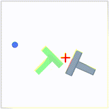
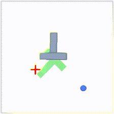
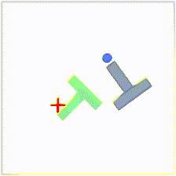

# RS2_Diffusion_Policy

<p align="center">
    
    
    
</p>

## Acknowledgement
This code was based on Diffusion Policy [paper](https://diffusion-policy.cs.columbia.edu/#paper) and notebooks for [state-based](https://colab.research.google.com/drive/1gxdkgRVfM55zihY9TFLja97cSVZOZq2B?usp=sharing) and [vision-based](https://colab.research.google.com/drive/18GIHeOQ5DyjMN8iIRZL2EKZ0745NLIpg?usp=sharing).

The code has been modified to allow users to collect their own data in simulation instead of using the data provided by the authors.

The system has been tested on Ubuntu 22.04 and 20.04.

## Installation
To reproduce our simulation benchmark results, install our conda environment on a Linux machine with Nvidia GPU.
First install Conda Environment. We recommend [Mambaforge](https://github.com/conda-forge/miniforge#mambaforge) instead of the standard anaconda distribution for faster installation.

When installing Manbaforge, remember to choose the option that adds the executable to your .bashrc. Then, whenever you open a new terminal, your command line will display (base)$.

Clone the RS2_Diffusion package.
```console
(base)$ git clone https://github.com/DinhDangKhoaLe/RS2_Diffusion.git && cd RS2_Diffusion
```
Use the following command to create a virtual environment named "RS2Diffusion" and install all the required packages.

```console
(base)$ conda env create -f conda_environment.yaml
```
Activate the environment. After running this command, the active environment will change from "base" to "RS2Diffusion".

```console
(base)$ conda activate RS2diffusion
```
## Inference
For using pre-trained model:

Download the pre-train model. This model was trained using 200 demonstrations over 200 epochs.

```console
(RS2diffusion)$ mkdir -p ckpt/image && cd ckpt/image && gdown 1sJOWmka15V7nL71jXH9Qs31aAw2zF9Bm && cd ../../

(RS2diffusion)$ python3 inference_pusht.py -i ckpt/image/pusht_checkpoint_final.pth
```
Note: When the simulation finishes, it will generate 10 MP4 files (by default) in the "videos" folder for evaluation. The evaluation data will not be the same as the training data.
A run is considered a success if the model pushes the block to cover at least 90% of the goal within 300 steps. Each video filename will include either 'failed' or 'succeeded' to indicate the outcome

If you want to generate more or less videos to evaluate:
```console
(RS2diffusion)$ python3 inference_pusht.py -i ckpt/image/pusht_checkpoint_final.pth -n "number_videos"
```

## Pertubation testing
```console
(RS2diffusion)$ python3 pertubation_testing.py -i ckpt/image/pusht_checkpoint_final.pth
```
Instruction for pertubating the T-block in the simulation: 

- Press "W", "S", "A", or "D" to move the block upward, downward, to the left, or to the right, respectively. These controls apply within the simulation application, not in the terminal.

- Press "C" to exit.

- The simulation will stop and save automatically after 500 steps or when the task is completed.

- Note: The diffusion policy does not complete the task with a 100% success rate, so in some cases, it may fail to recover after you perturb the block. It is better to perturb the block when the task is nearly completed.


## Creating Training Data Set
Run the data collection script:
```console
(RS2diffusion)$ python3 collect_data_pusht.py -o data/pusht_data.zarr
```

Instruction for collecting data in the simulation: 

- Hover mouse close to the blue circle to start.

- Push the T block into the green area. 

- The episode will automatically terminate if the task is succeeded.

- Press "Q" to exit and save the data.

- Press "R" to retry.

NOTE: The dataset should contain approximately 200 demonstrations, which takes around an hour to collect. You can exit and save by pressing 'Q' and resume data collection later if needed. To continue collecting data, rerun the command above and ensure you use the same dataset name.

If you want to skip the data collection step, download this dataset using the command below which already contains 200 collected demonstrations. You can also continue collecting more data on top of this by simply running the command mentioned above. Make sure the file name is correct.

```console
(RS2diffusion)$ mkdir -p data && cd data && gdown 1QOSBEQxVVEW-EJTmPTpUmUckPUVraNTw && unzip pusht_data.zarr.zip && cd ..
```


## Training 
The model will train on the input dataset and save checkpoints in the 'ckpt' folder.
Training will take approximately a few hours, depending on your GPU.
A GPU with more than 8GB of VRAM is recommended.
This code has been tested on NVIDIA RTX 3060 and 2080 Ti, where the training time is approximately 1 hour.

```console
(RS2diffusion)$ python3 train_pusht.py -i data/pusht_data.zarr
```

The checkpoint will be saved every 20 epochs. You can then test your model using the command in the Inference section. Remember to update the path to point to the specific model checkpoint you want to evaluate.

## Using state_based instead of vision_based 
The state_based assumes the knowledge of the exact position and oritentation of the T-block which derived from the simulation. Therefore, the observation for this setup only has 5 dimension the 2D pose of the T-block + position of the agent. All the commands for training and inference are below. Pertubation testing for the state has not been setup yet. 

```console
(RS2diffusion)$ python3 train_pusht_state.py -i data/pusht_data.zarr
(RS2diffusion)$ python3 inference_pusht_state.py -i ckpt/state/pusht_checkpoint_final.pth
```